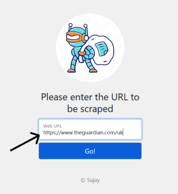
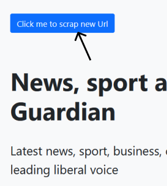

# Web Scraper

Description:  
* A clean UI Web Scraper created using Nodejs and deployed on Heroku.
* Extract title, description, image and other useful data of the desired Website by just the URL.

## Deployment

Go to the site https://web-scraper-sujay000.herokuapp.com/ it is cloud deployed on herokuapp

## Project Setup

1. Download/clone the repository
2. Make sure node and npm are installed in your machine
3. Run `npm install`
4. Run `npm start` to start the project.

## Running Tests

Just paste the website Url you want to scrape in the input box. ( for example https://www.theguardian.com/uk )

You will see the data scraped now and click on the button on the top left corner to scrape another site

## Color Reference

| Color             | Hex                                                                |
| ----------------- | ------------------------------------------------------------------ |
|  Color 1 |  #0d6efd |
|  Color 2 |  #F0F0F0 |
|  Color 3 |  #212529 |

